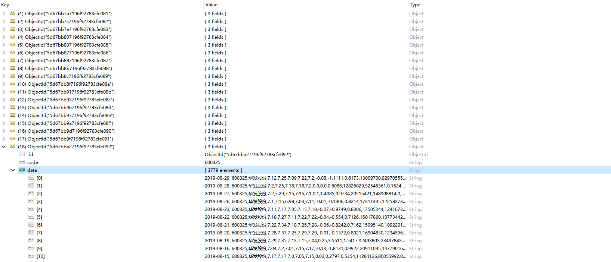

### 东方财富网沪深A股分布式爬虫

**实际是两个爬虫：**

StockList部分用于爬取股票数据下载链接存入redis

StockData部分从redis中获取下载链接并将数据存入MongoDB

**主要的依赖库：**

```
python-3.5

scrapy-1.5.1

scrapy-redis-0.6.8

pymongo==3.8.0
```

具体可查看conda环境配置文件：[environment.yaml](./environment.yaml)

**已经实现的功能：**

- 分布式爬取

- 随机用户代理

- 爬取完成自动停止

**待完善的功能：**

- 随机IP

- Zookeeper集群监控

- 邮件提醒

### 项目部署

笔者采用三个节点器来爬取数据，OS都为Ubuntu18.04。一个节点放StockList部分，其他两个节点放StockData部分。环境配置采用Anaconda3

1.创建运行环境

```
conda env create -f environment.yaml
```

2.将开始链接（stock:start_url）写入redis

```
sadd stock:start_url http://2.push2.eastmoney.com/api/qt/clist/get?&pn=1&pz=20&po=1&np=2&fltt=2&fid=f3&fs=m:0+t:6,m:0+t:13,m:0+t:80&fields=f12,f14 

sadd stock:start_url http://94.push2.eastmoney.com/api/qt/clist/get?&pn=1&pz=20&po=1&np=2&fltt=2&fid=f3&fs=m:1+t:2&fields=f12,f14
```

3.爬取股票数据下载链接

进入StockList项目下执行：

```
scrapy crawl stocklist
```

4.爬取股票数据到MongoDB

分别进入StockData目录下执行：

```
scrapy crawl stockdata
```

5.查看MongoDB数据

考虑到爬取速度，所有数据存入一个集合，每支股票数据对应一个文档




